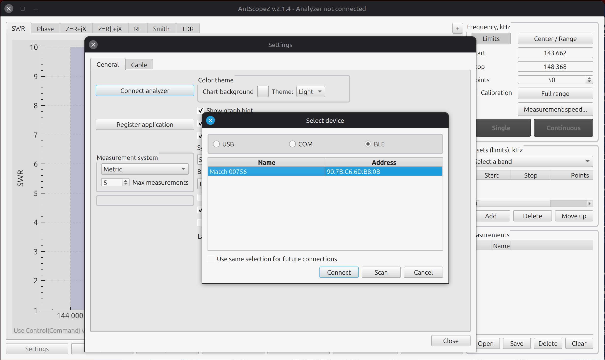
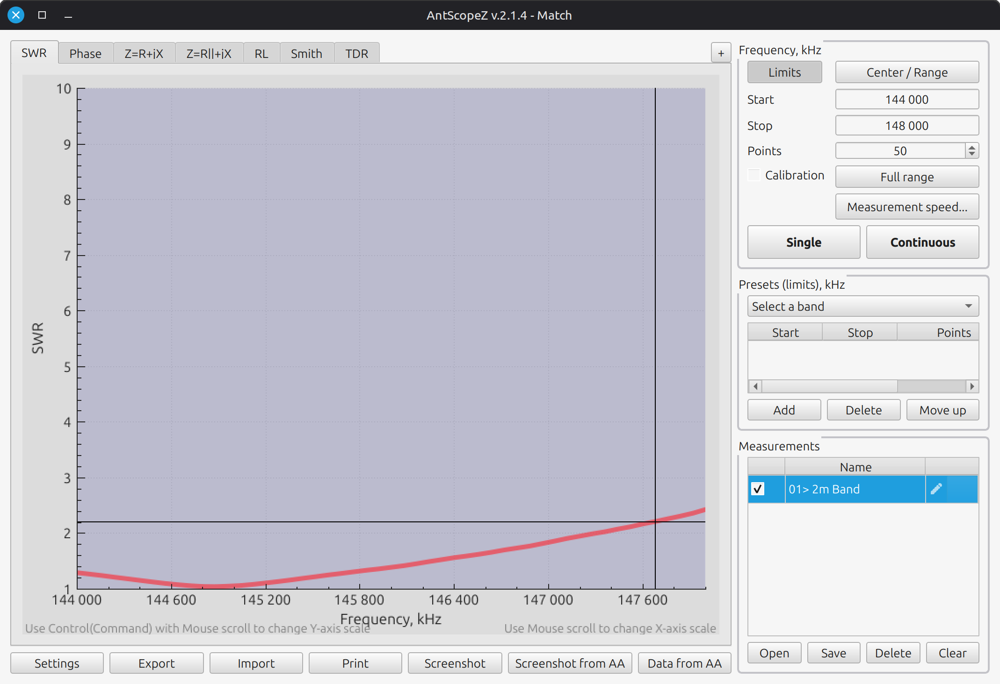
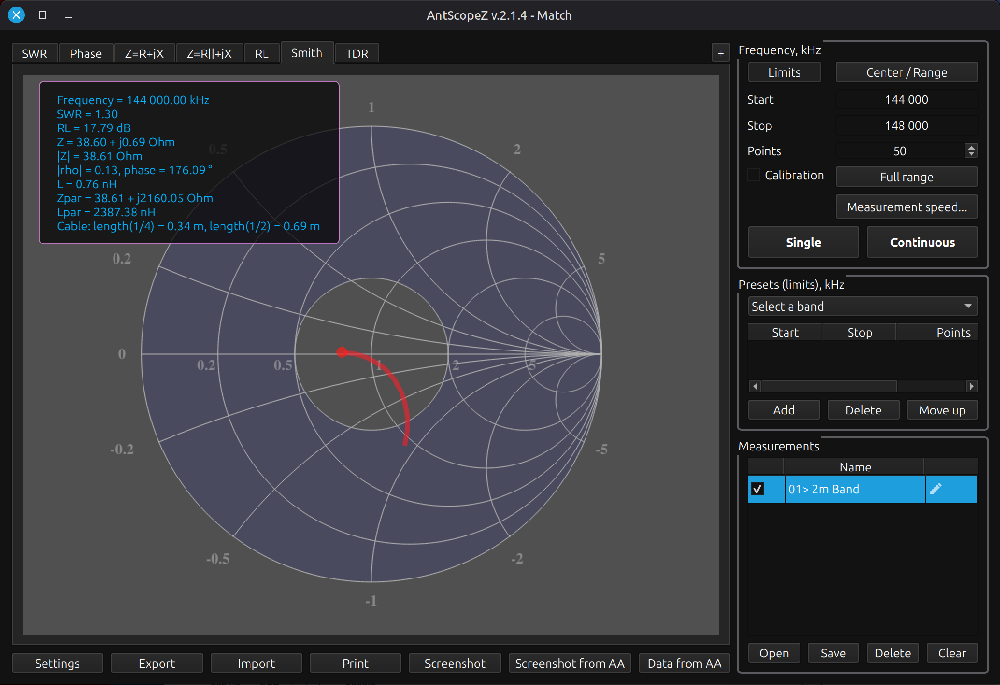
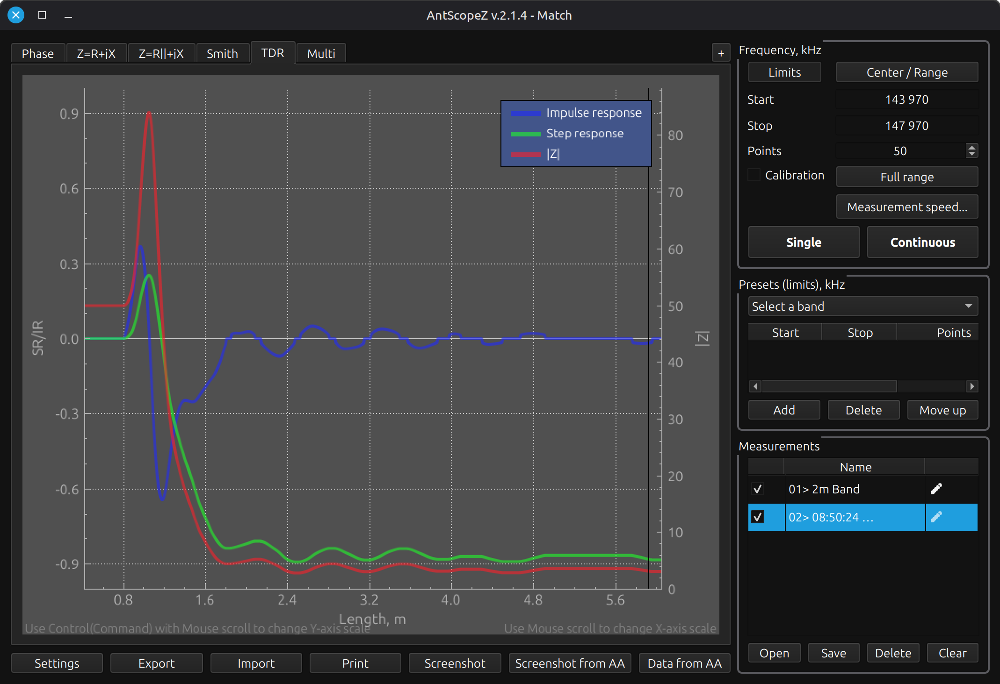
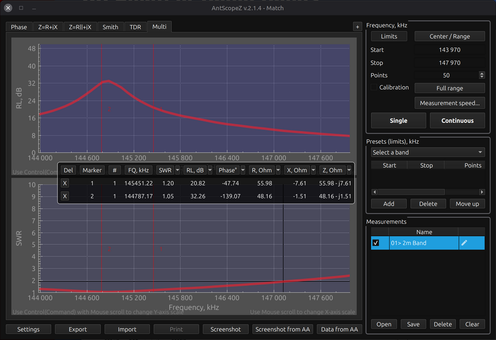
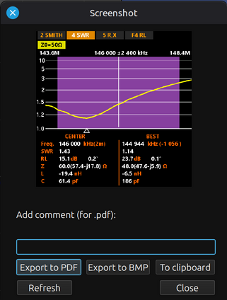

# AntScopeZ

A modern antenna-analyzer application for RigExpert hardware (and a few
other brands) -- built for, and maintained by, the ham radio community.

**[⬇ Download the latest release](https://github.com/K4HEZ/AntScopeZ/releases/latest)**
&nbsp;·&nbsp;
[Browse the source](https://github.com/K4HEZ/AntScopeZ)
&nbsp;·&nbsp;
[Report an issue](https://github.com/K4HEZ/AntScopeZ/issues)

## Screenshots

*Connecting to an analyzer (here, a RigExpert Match, over BLE) -- Light theme.*

*An SWR sweep across the 2m band, with the band shaded on the chart -- Light theme.*

*Smith chart with a live cursor readout (Z, SWR, RL, and more) -- Dark theme.*

*TDR (Time Domain Reflectometry): impulse/step response and impedance
along the cable, useful for finding a fault's approximate distance.*

*Multi view: compare RL/SWR (or any pair of charts) across saved
measurements side by side, with markers.*

*"Screenshot from AA" -- captures the analyzer's own on-device display,
not just AntScopeZ's chart.*

## Why AntScopeZ?

AntScopeZ is a fork of RigExpert's own AntScope software, renamed and
rebuilt to give it its own identity, separate from the vendor's. Along the
way it's had a real Light/Dark theme added and a steady stream of
UI/usability fixes -- see [CHANGELOG.md](CHANGELOG.md) for the full
detail.

**This is not an official RigExpert product.** It's an independent,
unaffiliated, community effort -- see the disclaimer in
[README.md](https://github.com/K4HEZ/AntScopeZ#readme) before relying on
it for anything that matters (licensing, firmware updates, warranty
support). For those, use RigExpert's own software -- the original
AntScope2 is available directly from RigExpert at
[rigexpert.com/software/antscope2](https://rigexpert.com/software/antscope2/).

## Supported devices

AntScopeZ isn't limited to RigExpert's own analyzers -- NanoVNA and a
couple of other brands are supported too. See
[SUPPORTED_DEVICES.md](SUPPORTED_DEVICES.md) for the full list, and its
disclaimer: most listed devices haven't been individually tested against
this fork.

## Documentation

- **[User Guide](docs/user-guide.md)** -- how to use AntScopeZ (TDR
  scans, customized analyzer parameters, and more as it grows)
- **[Supported Devices](SUPPORTED_DEVICES.md)** -- full device list
- **[Build Instructions](BUILDINFO.md)** -- building from source, Qt
  version notes, platform-specific detail
- **[Changelog](CHANGELOG.md)** -- what's changed, release by release
- **[Third-Party Licenses](THIRD-PARTY-LICENSES.md)** -- full
  component-by-component license breakdown

## License

AntScopeZ is licensed under the **GNU General Public License v3.0 or
later** ([COPYING](COPYING)) as a whole, since it bundles GPLv3-licensed
components (QCustomPlot, HIDAPI). AntScopeZ's own code -- both the original
RigExpert AntScope2 codebase it's forked from and everything added or
modified since -- remains separately available under the MIT license
([LICENSE.txt](LICENSE.txt)). Qt and libusb are used under their LGPL
terms, and a Windows-only FTDI driver package is bundled under FTDI's own
proprietary redistribution terms -- see
[THIRD-PARTY-LICENSES.md](THIRD-PARTY-LICENSES.md) for the full
per-component, per-platform breakdown.

## Getting help

This is a volunteer-maintained fork, not a supported product -- there's
no SLA and no guarantee of a fix or a timely reply. That said,
[GitHub Issues](https://github.com/K4HEZ/AntScopeZ/issues) is the right
place to report a bug or ask a question about this fork specifically. For
anything involving RigExpert's own hardware, firmware, or licensing,
contact RigExpert directly -- this project has no connection to them and
no way to help with those.

---

*Built with help from [Claude](https://www.anthropic.com/claude)
(Anthropic's AI) -- docs, this site, and a fair bit of the code itself.*
